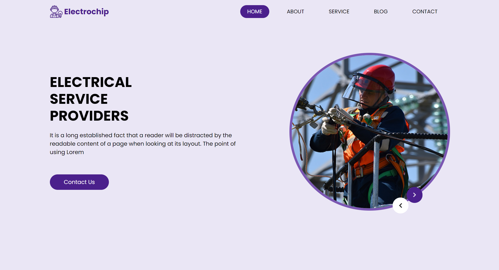

# Electrochip

Bienvenue sur le repository GitHub d'**Electrochip**, votre spécialiste en solutions électriques pour projets résidentiels, commerciaux et industriels, dédié à fournir des services électriques personnalisés avec expertise, fiabilité et innovation.

## À Propos

**Electrochip** s'engage à offrir excellence et satisfaction client dans le domaine électrique, en mettant en avant notre passion pour l'innovation et la qualité de service.

### Services

- **Solutions personnalisées :** Des services électriques sur mesure pour répondre à tous vos besoins.
- **Expertise et fiabilité :** Une équipe d'experts dédiée à la réalisation de vos projets avec professionnalisme.
- **Innovation :** L'utilisation des dernières technologies pour des solutions plus efficaces et durables.

## Technologies Utilisées

Ce projet est réalisé avec WordPress, mettant en avant un thème custom développé spécifiquement pour notre activité et pour refléter notre engagement envers la qualité et l'innovation.

